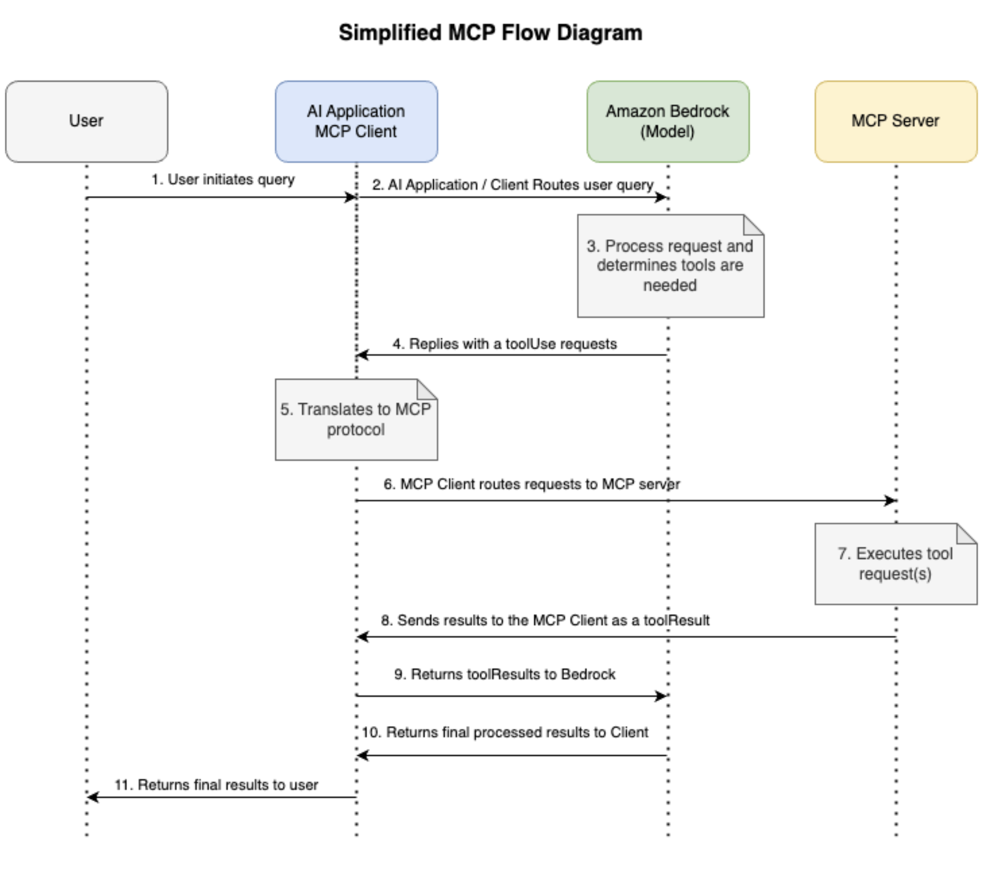

# MCP Integration with Amazon Bedrock Knowledge Bases

This repository outlines a basic implementation of the [Model Context Protocol](https://modelcontextprotocol.io/) integration with Amazon Bedrock Knowledge Bases

## Overview

There are two parts to this implementation:

1. The `user_interfaces/chat_bedrock_st.py` file, which handles the Streamlit/User Interface for the chatbot
2. The `client_server.py` file, which handles the MCP client and server implementation

The exact MCP server code leveraged can be found in the [src/bedrock-kb-retrieval-mcp-server](../../src/bedrock-kb-retrieval-mcp-server/) folder.

### Architecture



## Setup

### Prerequisites

- The [uv](https://docs.astral.sh/uv/getting-started/installation/) package manager
- AWS Account with Bedrock access and proper IAM permissions
- A Bedrock Knowledge Base
  - For a quick reference Knowledge Base setup, check out the [e2e RAG solution via CDK](https://github.com/aws-samples/amazon-bedrock-samples/tree/main/rag/knowledge-bases/features-examples/04-infrastructure/e2e_rag_using_bedrock_kb_cdk) repo. This will set you up with everything you need - IAM roles, vector storage (either OpenSearch Serverless or Aurora PostgreSQL), and a fully configured Knowledge Base with sample data. The Knowledge Base is the only component you'll really need for this implementation.

Copy the .env.example file to .env and add your AWS credentials.

```bash
cp .env.example .env
```

### Installation

1. Clone the repository.

```bash
git clone <INSERT_REPO_URL>
```

2. Open two different terminals and install the dependencies in each.

```bash
uv sync
```

then activate the virtual environment

```bash
source .venv/bin/activate
```

3. In one of the terminals, run the FastAPI server

```bash
uvicorn clients.client_server:app --reload
```

4. In the other terminal, run the Streamlit app

```bash
streamlit run user_interfaces/chat_bedrock_st.py
```

5. The chatbot should now be running on [http://localhost:8501/](http://localhost:8501/)

## Usage

Grab your Bedrock Knowledge Base ID from the Bedrock Knowledge Base console and add it to the UI first on the left hand side menu.

Ask away!

## Troubleshooting

Logs are available in the terminal where you ran the FastAPI server, outlining various steps and actions taken by the server.

If you see an error about `boto3` not being found, it is likely because you did not activate the virtual environment:

```bash
uv sync
source .venv/bin/activate
```
